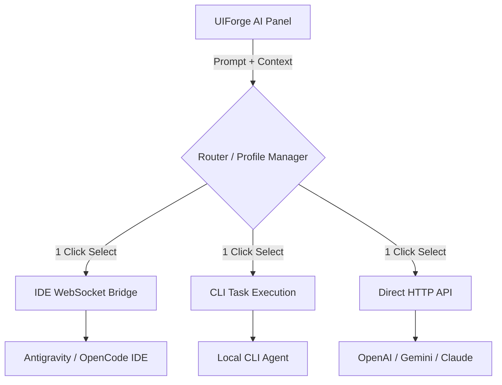

# Lộ trình phát triển tiếp theo cho UIForge AI

Tài liệu này lưu trữ các phân tích, định hướng và kiến trúc kỹ thuật quan trọng cho các giai đoạn phát triển tiếp theo của UIForge AI, bao gồm việc tận dụng mã nguồn mở và tích hợp AI thông minh qua IDE.

---

## 1. Tận dụng GitHub Repositories để tăng tốc phát triển

Dự án hiện đã hoàn thiện **UI Shell** (bố cục 3 cột, hệ thống icon, dark theme). Để xây dựng "Visual Engine" (kéo thả, chọn phần tử, undo/redo) mà không phải code lại từ đầu, chúng ta sẽ sử dụng các thư viện mã nguồn mở chuyên dụng sau:

### Nhóm Xây dựng Visual Editor (Kéo thả, State Management)
1. **[Craft.js (prevwong/craft.js)](https://github.com/prevwong/craft.js)** 🌟 *(Khuyên dùng nhất)*
   - **Tác dụng:** Cung cấp toàn bộ "đường ống" (plumbing) cho một trình builder: hệ thống kéo thả, quản lý state, history (undo/redo), serialize/deserialize cấu trúc component. Khớp hoàn hảo với kiến trúc "Manual Edit Engine".
2. **[Puck (puckeditor/puck)](https://github.com/puckeditor/puck)**
   - **Tác dụng:** Một visual editor có sẵn UI, hỗ trợ kéo thả component React trực tiếp. Dễ tích hợp nếu cần một giải pháp nhanh gọn.

### Nhóm Tương tác Canvas (Pan, Zoom)
3. **[react-zoom-pan-pinch (prc5/react-zoom-pan-pinch)](https://github.com/prc5/react-zoom-pan-pinch)**
   - **Tác dụng:** Bọc vùng `CanvasArea` để xử lý ngay tính năng Pan (kéo thả bề mặt) và Zoom (cuộn chuột) y hệt như trải nghiệm trên Figma mà không cần tự tính toán tọa độ chuột phức tạp.

### Nhóm Drag & Drop thuần túy
4. **[dnd-kit (clauderic/dnd-kit)](https://github.com/clauderic/dnd-kit)**
   - **Tác dụng:** Tiêu chuẩn hiện đại nhất cho Drag & Drop trong React. Phù hợp để làm tính năng sắp xếp Layers ở Sidebar hoặc kéo thả ảnh từ tab Assets.

### Nhóm Phân tích và Sửa Code (Dành cho Agent Bridge)
5. **[jscodeshift (facebook/jscodeshift)](https://github.com/facebook/jscodeshift)**
   - **Tác dụng:** Parse Javascript/Typescript thành AST (Abstract Syntax Tree) và modify code an toàn.

---

## 2. Kiến trúc tích hợp IDE (Antigravity & OpenCode)

Để giải quyết bài toán **tích hợp AI hoàn toàn miễn phí**, UIForge sẽ không gọi trực tiếp API của OpenAI hay Google. Thay vào đó, UIForge đóng vai trò là **"Visual Sidecar" (Đôi mắt)**, giao tiếp trực tiếp với IDE (Antigravity IDE / OpenCode) - đóng vai trò là **"Bộ não"**.
## 2. Kiến trúc AI Đa Cầu Nối (Multi-Bridge Architecture)

Thay vì chỉ hỗ trợ một phương thức, UIForge AI sẽ được thiết kế với cơ chế **Cắm và Chạy (Plug & Play)** hỗ trợ 3 phương thức kết nối khác nhau. Người dùng có thể lưu cấu hình và **chuyển đổi nhanh chóng bằng 1 click** ngay trên thanh TopBar hoặc AIPanel.

### Các phương thức kết nối (Bridges)

1. **IDE WebSocket Bridge (Miễn phí & Khuyên dùng)**
   - **Cơ chế:** UIForge đóng vai trò là "Visual Sidecar". Khi ra lệnh, UIForge gửi Context qua `ws://localhost:45678`. Một Plugin cài trên Antigravity IDE hoặc OpenCode sẽ nhận tín hiệu và mớm lệnh vào bộ não AI của IDE.
   - **Ưu điểm:** Miễn phí 100% (dùng AI của IDE), an toàn, IDE tự quản lý AST và file.

2. **CLI Bridge (Tích hợp Local)**
   - **Cơ chế:** Cấu hình đường dẫn tới CLI của AI Agent (ví dụ: `antigravity-cli`). Khi UIForge cần sửa code, nó sẽ spawn một process ngầm chạy lệnh CLI truyền kèm prompt và đường dẫn file ảnh.
   - **Ưu điểm:** Không cần phụ thuộc IDE mở. Agent tự thực thi code và thao tác trong terminal.

3. **API Bridge (Trả phí / Đám mây)**
   - **Cơ chế:** Nhập trực tiếp API Key của OpenAI (GPT-4o), Anthropic (Claude) hoặc Google (Gemini). UIForge sẽ gửi HTTP Request với ảnh và context trực tiếp lên server.
   - **Ưu điểm:** Dễ setup nhất, hoạt động trên mọi máy tính không cần cài IDE/CLI. Phù hợp khi dự án có ngân sách, cần sự linh hoạt cao. (Đặc biệt hỗ trợ local LLM qua Ollama endpoint để dùng miễn phí).

### Cơ chế Quản lý & Chuyển đổi nhanh (1-Click Switch)

Để linh hoạt nhất, ứng dụng sẽ có tính năng **Connection Profiles**:

- Dữ liệu cấu hình (Port WebSocket, Path CLI, API Keys) được lưu an toàn trong file local config (ví dụ `~/.uiforge/config.json`) hoặc `localStorage`.
- Trên UI (khu vực AI Settings), hiển thị danh sách các Profile.
- **1 Bấm:** Chỉ cần click chọn "Antigravity IDE", "Ollama Local", hoặc "GPT-4o API", hệ thống sẽ lập tức route các lệnh prompt qua Bridge tương ứng mà không cần khởi động lại.

